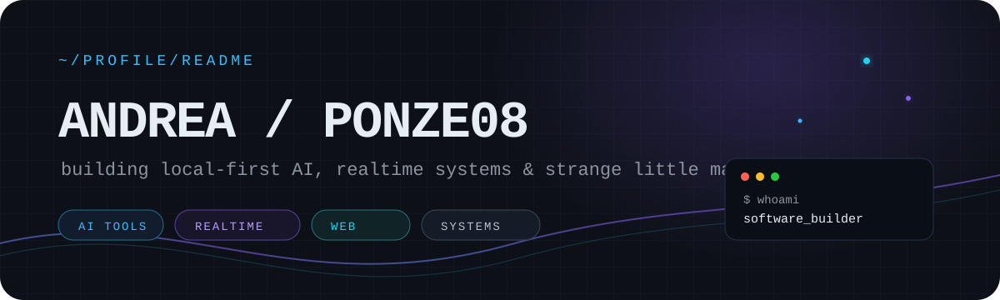
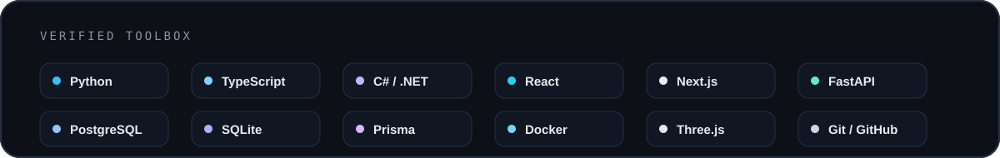
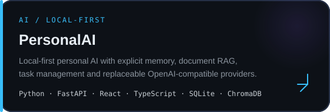
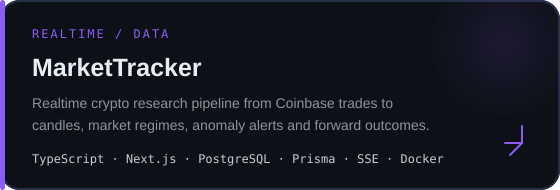
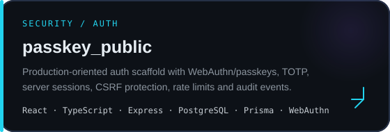
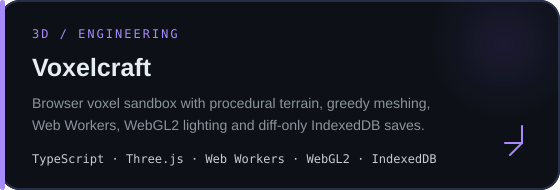
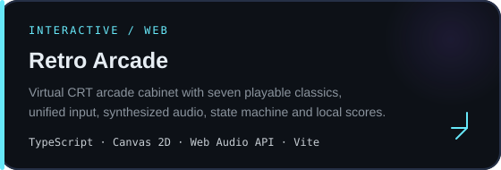
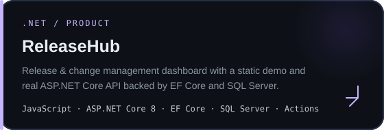
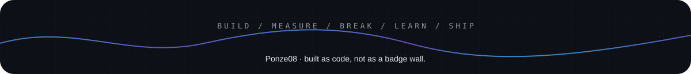

 

## `> whoami`

I'm **Andrea / Ponze08**, a software developer who likes building projects end-to-end — from data flow and persistence to UI, failure modes and the weird edge cases in between.

My repositories currently orbit four recurring ideas:

- **Local-first AI** — explicit memory, document retrieval, private-by-default persistence.
- **Realtime systems** — WebSockets, SSE, event pipelines, market data and synchronized multiplayer.
- **Security-minded software** — passkeys/WebAuthn, TOTP, server sessions, CSRF protection and auditability.
- **Interactive experiments** — browser games, procedural 3D worlds, utility tools and interfaces that behave like products.

 

 

## `> featured_work`

<table>
<tr>
<td width="50%">

</td>
<td width="50%">

</td>
</tr>
<tr>
<td width="50%">

</td>
<td width="50%">

</td>
</tr>
<tr>
<td width="50%">

</td>
<td width="50%">

</td>
</tr>
</table>

[**Play Retro Arcade ↗**](https://ponze08.github.io/arcade/) &nbsp;&nbsp;·&nbsp;&nbsp;
[**Open ReleaseHub demo ↗**](https://ponze08.github.io/releasehub/)

 

### `// more experiments`

[`NeonDrift`](https://github.com/Ponze08/NeonDrift) ·
[`ImpostorGame`](https://github.com/Ponze08/ImpostorGame) ·
[`TimeTool_public`](https://github.com/Ponze08/TimeTool_public) ·
[`DianetTheme_public`](https://github.com/Ponze08/DianetTheme_public) ·
[`rubik_cube_site_v2`](https://github.com/Ponze08/rubik_cube_site_v2) ·
[`ticino-calendar`](https://github.com/Ponze08/ticino-calendar)

 

## `> github_pulse`

> I keep this section intentionally small. The useful part of the profile is the code above it.

 

## `> connect`

- GitHub: [**@Ponze08**](https://github.com/Ponze08)
- Email: **info@andreaponzellini.com**

 

